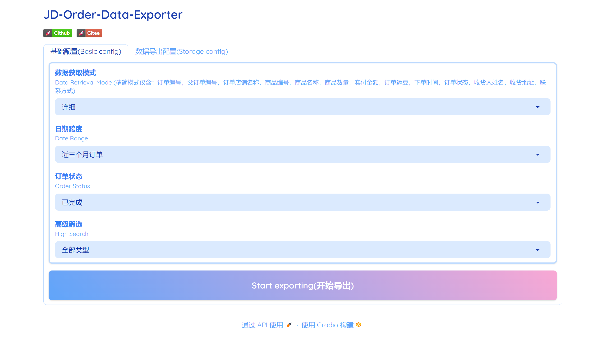
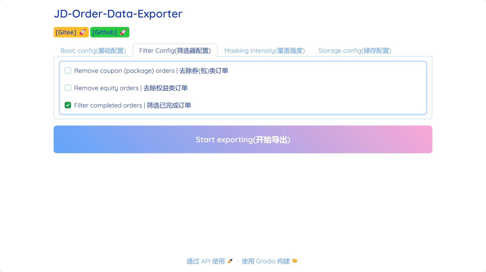
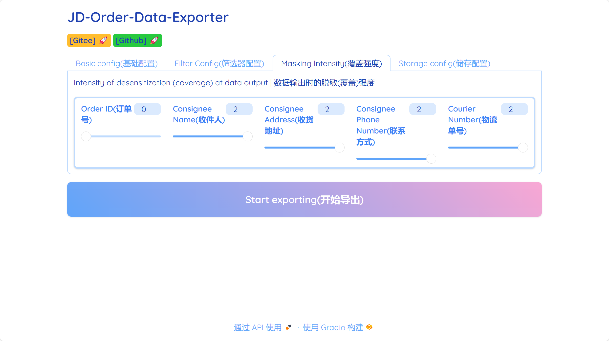
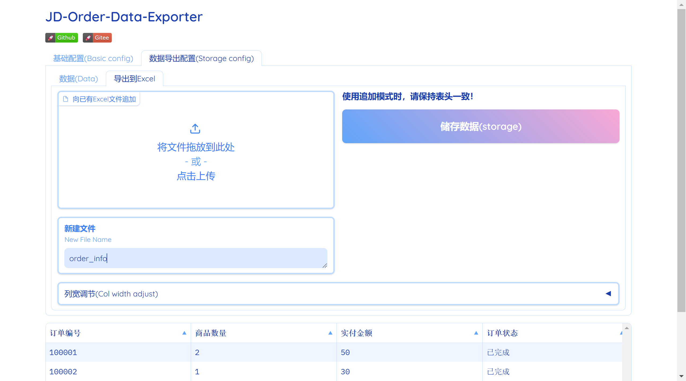
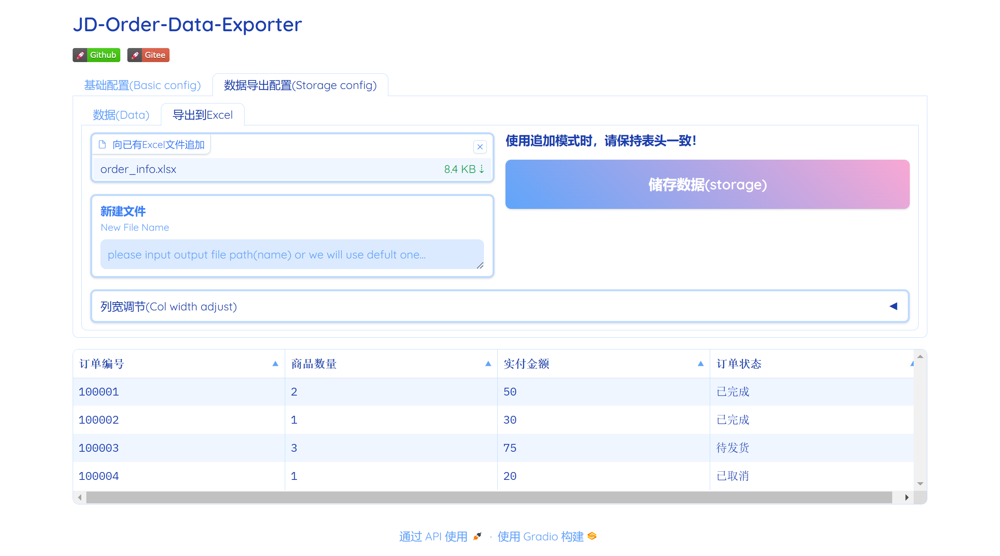

# JD-PersDataExporter
[**简体中文**](./README.md) | [**English**](./README.en.md)
## One-sentence introduction
- The project is a local automated tool for exporting order information for personal accounts on JD.com.

## instructions

#### webUI mode

<figure>
<figcaption>
Fill in the account number nickname (required, for login verification), select the date span and the required information in the two drop-down lists, click the button "Start export", the browser will jump to the login interface, normal login can be. </figcaption>

<figcaption>webUI main interface </figcaption>
</figure>

<figure>
<figcaption>
Order type filtering Settings, if you need to change, please set before clicking the button "Start export". </figcaption>

<figcaption> Filter setup screen </figcaption>
</figure>

<figure>
<figcaption>
Desensitization (overlay) intensity selection (0: none, 1: weak, 2: strong), if you need to change, please set before clicking the button "Start export". </figcaption>

<figcaption> Desensitization intensity setting interface </figcaption>
</figure>

<figure>
<figcaption>

 Click the button "Start Export" and after the operation is complete, the interface will be loaded in the main interface. 

 In this interface, you can preview the data, and you can change the number or order of the options in the Header first; 2. Click the button "Change Required Data") to modify the data preview view. 

 Save data: What you see in the data preview view is what you get. 1. Select an export mode. 2. Enter the corresponding save Settings. 3. Click the button "Save" 

</figcaption>

<figcaption> Data preview and storage interface </figcaption>
</figure>

<figure>
<figcaption>
</figcaption>

<figcaption>Excel Store Setup screen </figcaption>
</figure>

<figure>
<figcaption>
</figcaption>

<figcaption>MySQL Storage Settings screen </figcaption>
</figure>

#### pure script mode
1. Follow these instructions after downloading the unzipped project package
- Open config.json (configuration file)
- Fill in the complete account name in "" after "" user_name" ". This account name is used only for login verification.
- Writes the time grouping of the order to be fetched in [] after `date_range`. Must write full option field! If this parameter is not set, order information of the last three months is obtained by default. \
Example: `["ALL"]` will get all order information in the account; `["2022 order ", "2023 order ", "2016 order "]` will obtain all order information for the three years 2023, 2022, 2016.

| Time groups optional (same as on my order page)|
|---|
|ALL 
| Orders in the last three months
| Order within this year
| Order for 2023
| Orders for 2022
| Orders for 2021
| Order for 2020
| Orders for 2019
| Orders for 2018
| Orders for 2017
| Orders for 2016
| Orders for 2015
| Orders for 2014
| Order for 2023
| Orders made before 2014
- In '[]' after 'header', set the type of information you want to get the order. By default, all is obtained. \
Example: '["product_name", "order_id", "amount"]' The generated Excel file has the product name in the first column, the order number in the second column, and the total amount (actual payment) in the third column.

| | is optional. The information type is |
|---|---|
order_id| The order number
product_name| Product name
goods_number| Product quantity
amount| Total amount (paid)
order_time| Order time
order_status| The status of the order
consignee_name| Recipient name
consignee_address| The receiving address
consignee_phone_number| The recipient's contact information (the source is desensitized)
- '"filter_config"' subentry allows you to select the type of filter order, which will eventually affect the output result.
Example: If 'Remove Coupon (package) class order' is set to 'true', then the output order will not contain coupon (package) class order. \
In addition, custom filtering by keyword is also set, where the value of 'header_item' can only be the name of the existing header_item; '"keyword"' Enters one or more keywords to filter. \
Example: If 'header_item' has a value of 'product_name' and 'keyword' has a value of '[' millet', 'effervescent tablets'], then only orders with' millet 'or' effervescent tablets' in the item name will be retained.
- 'masking_intensity' The value of the subterm represents the desensitization intensity of the information. The value is of type int.

| optional | Intensity |
|:---:|:---:|
0| none
1| weak
2| strong

If you need to export to the same file multiple times, ensure that the desensitization intensity is consistent each time (at least order_id).

- The value of "export_mode" is used to set the data export mode.

| optional |
|---|
|excel
|mysql

Select 'mysql' to configure the relevant information in the 'mysql_user.ini' file.

2. Start the tool and use it
- Double-click the exe file and wait until the login page is displayed.
- Login to your Jingdong account, it is recommended to use the scan code login (convenient and quick), other ways are also OK.
- Some accounts may have secondary security verification. Such as: graphic verification, slider verification, mobile phone number verification code again login verification, the first few digits and the last few digits of ID card verification. (Again, all information is used and processed locally, please be assured of security verification)
- Wait for the program to execute without closing the browser window (which can be minimized); The end of the program will automatically close the terminal window, at this time in the exe file directory can find the Excel file containing the order information.

## Environment and dependence
- python version: 3.12.0
- Chrome: indicates the chromedriver corresponding to Chrome
- Some packages are of newer versions, but this does not mean that earlier versions are unavailable.

    |name|versions|
    |:---:|:---:|
    parsel|1.9.1
    selenium|4.21.0
    openpyxl|3.1.2
    pandas|2.2.2
    mysql-connector-python|8.4.0
