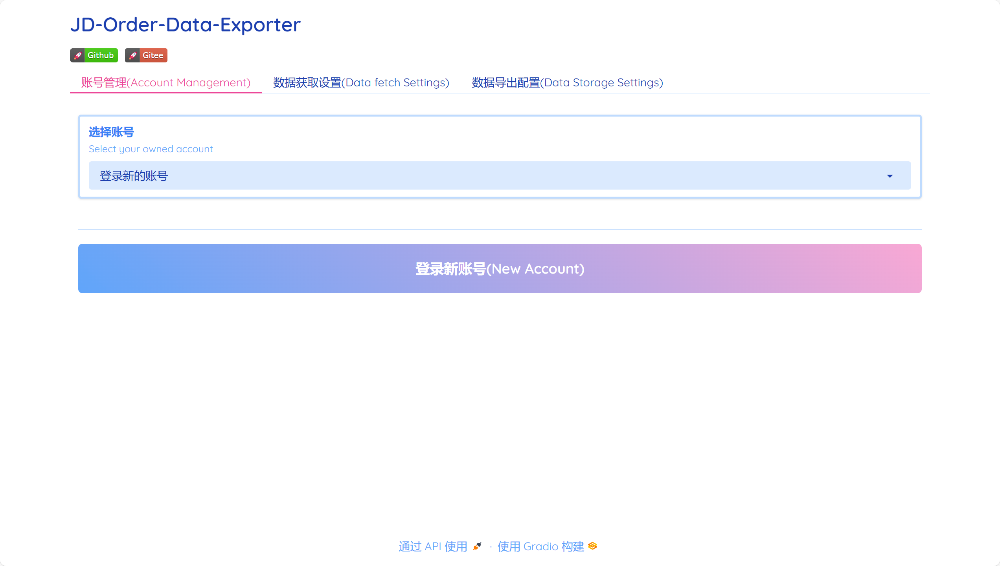
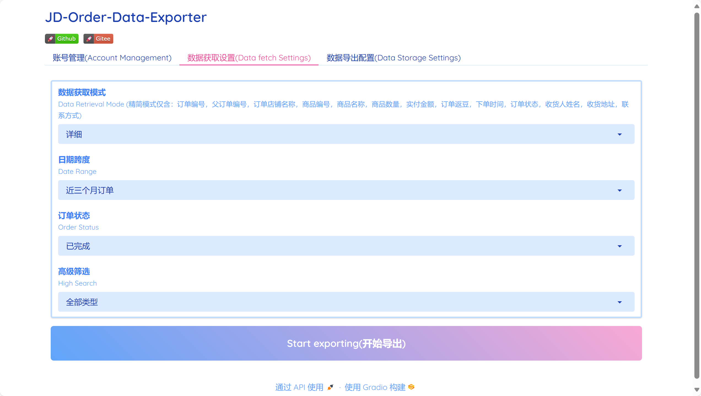
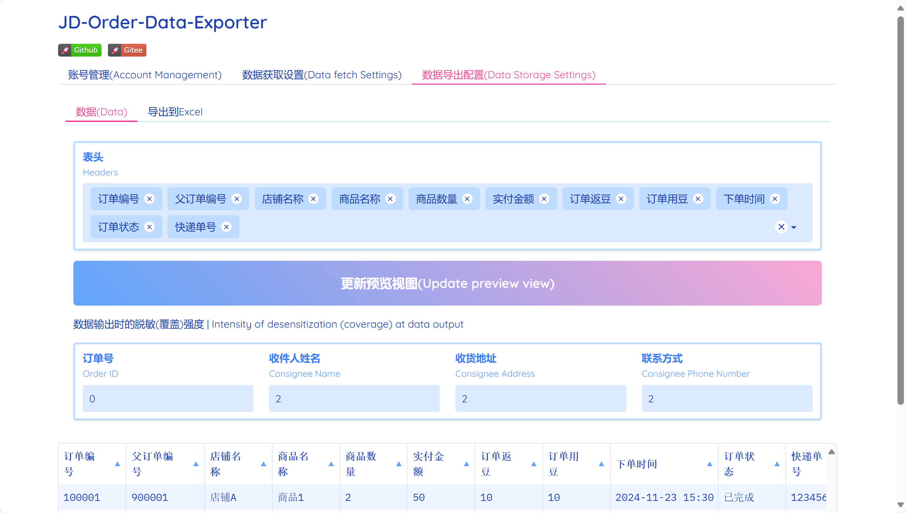
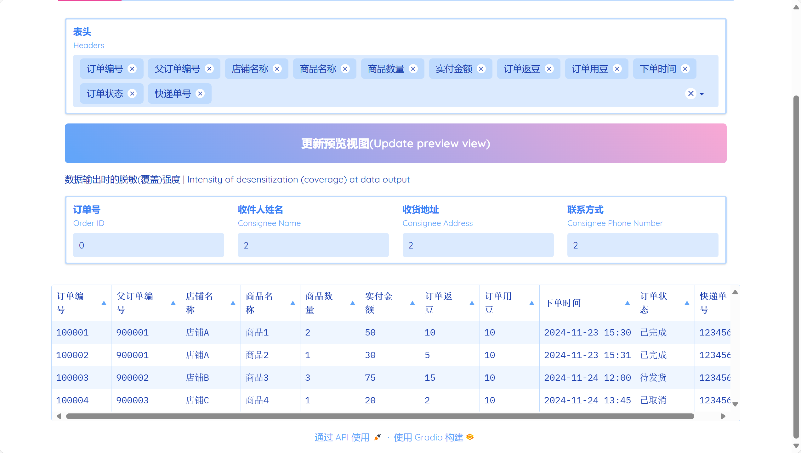
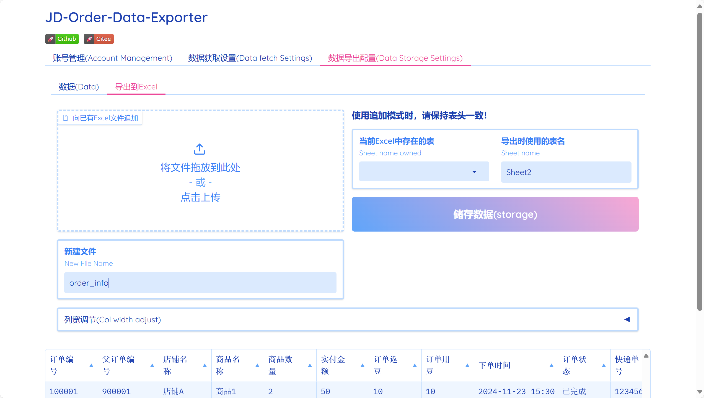
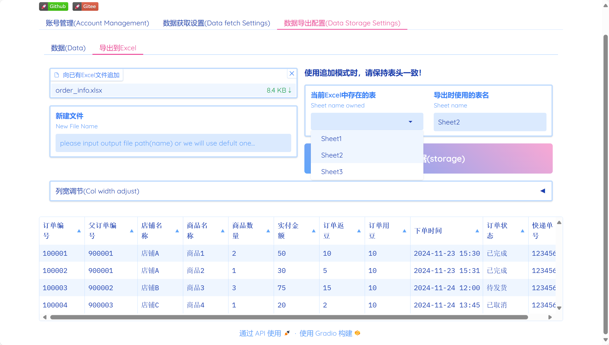
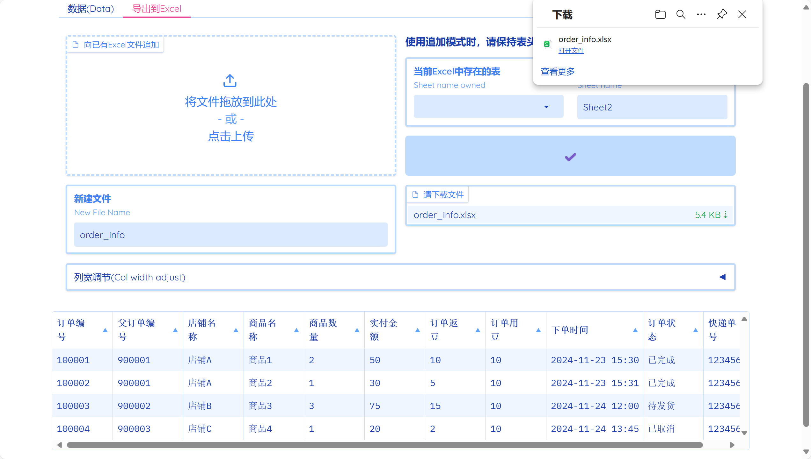

# JD-PersDataExporter
version: JD-PersDataExporter-2.3.10

## 简介
- 该项目是一个本地自动化工具，用于导出京东个人账户的订单信息。

## 注意事项
- 自动化运行期间不要手动点击，或关闭运行窗口。
- 保持网络通畅，如遇到页面卡死，丢失，访问失败导致程序异常退出，请重启程序。

## 快速开始

#### webUI模式

##### 账号管理

<figure>
    <figcaption>
    点击“登录新账号”来添加账号记录</figcaption>
    
    <figcaption>
    拥有多账号记录可以在此页面切换</figcaption>
    
</figure>

##### 数据获取

<figure>
    <figcaption>
    使用下拉列表选择数据获取模式与订单筛选要求，点击按钮“开始导出”，首次运行会跳转浏览器到登录界面，正常登录即可。</figcaption>
    
</figure>

##### 数据导出

<figure>
    <figcaption>1. 表头请务必保留 `订单编号` 字段，选中的表头字段的顺序即为最终Excel表头顺序。</figcaption>
    <figcaption>2. 如有数据脱敏需求，自行调节等级；</figcaption>
    
    <figcaption>3.每次变更设置后点击 “更新预览视图” 来调整数据表</figcaption>
    <figcaption>4.数据预览视图包含的数据即为数据导出时的数据</figcaption>
    
</figure>

<figure>
    <figcaption>导出到Excel有两种方式：</figcaption>
    <figcaption>1.新建Excel文件</figcaption>
    
    <figcaption>2.向已有的Excel文件追加</figcaption>
    
    <figcaption>3.两种方式对应的组件只能选择其一，然后点击“储存数据”，若符合要求便会储存成功，然后就可以下载文件了QwQ</figcaption>
    
</figure>

#### exe模式
下载解压项目压缩包后按照以下说明进行
1. 使用前调整配置文件：
    (1) 打开config.json（配置文件）
    (2) 数据获取模式
        将`data_retrieval_mode`设置为`精简`或`详细`。
    (3) 订单时间跨度
        将`date_search`设置为需要的值，可选值与JD订单列表页面提供的一致，如`近三个月订单`，`2023年订单`。
    (4) 订单状态筛选
        将`status_search`设置为需要的值，可选值JD订单列表页面提供的值一致，如`已完成`。
    (5) 高级筛选
        将`high_search`设置为需要的值，可选值JD订单列表页面提供的值一致，如`已完成`
    (6) 需要的数据
        在`headers`中按顺序设置需要的表头，`订单编号`为必选，如`["订单编号", "商品名称", "下单时间"]`。

    |精简|详细(追加)|
    |---|---|
    订单编号|物流公司
    父订单编号|快递单号
    店铺名称|商品总价
    商品编号|订单用豆
    商品名称|
    商品数量|
    实付金额|
    订单返豆|
    下单时间|
    订单状态|
    收货人姓名|
    收货地址|
    收货人电话|
  
2. 启动工具并使用
  (1) 双击运行exe文件，等待浏览器跳转到登录界面。
  (2) 登录你的京东账号，建议使用扫码登录(方便快捷)，其他方式也行。
  (3) 部分账号登录过程中有概率会出现二次安全验证。如：图形验证，滑块验证，手机号验证码再次登录验证，身份证前几位和后几位验证等。(再次声明，所有信息均在本地使用和处理，请放心通过安全验证)
  (4) 等待程序执行，期间不要关闭浏览器窗口(可以最小化)；程序结束会自动关闭终端窗口，此时在exe文件所在目录可以找到包含订单信息的Excel文件。

## 环境与依赖
- python版本: 3.12.0
- Edge或Chrome浏览器，其余未经测试。
- 部分包为较新版本，并不代表低版本不可用，详见 requirements.txt.
  
# Update log
- JD-PersDataExporter-2.3.10: webUI细微调整；2025适配更新；
- JD-PersDataExporter-2.3.9: 新增了多账号管理功能；优化了账号登录逻辑；优化了Excel储存设置；更新了webUI；
- JD-PersDataExporter-2.2.9: 更新了 requirements.txt
- JD-PersDataExporter-2.2.8: 更新README；修复版本名称错误；
- JD-PersDataExporter-2.2.7: 业务逻辑重构完成；webUI重构完成；
- JD-PersDataExporter-2.1.6: webUI重构，配置微调
- JD-PersDataExporter-2.1.5: 使用 playwrite 框架进行重构，并调整工具逻辑；
- JD-PersDataExporter-2.1.4: 优化了Excel储存方式中对列数据类型与单元格格式的设置
- JD-PersDataExporter-2.1.3: 优化了DatabaseManager，使数据库的连接与使用更优雅。
- JD-PersDataExporter-2.1.2: 优化了物流公司和物流单号的获取方法。
- JD-PersDataExporter-2.1.1: 为webUI添加了跟随系统明暗模式的主题。
- JD-PersDataExporter-2.0.1：优化了部分工具逻辑，使浏览器的生存周期更合理。
- JD-PersDataExporter-2.0.0: 为工具添加了webUI入口，具有简单的样式设计，使其更美观，易使用。
- JD-PersDataExporter-1.8.7: 优化了从订单详情获取数据的部分方法(添加脱敏(覆盖)，正则优化)。
- JD-PersDataExporter-1.8.6：新增了部分数据信息的获取，导出。
- JD-PersDataExporter-1.7.6：为所有模块添加了简单的日志记录，使用全局配置管理。
- JD-PersDataExporter-1.6.6: 补齐了所有模块对应的test文件。
- JD-PersDataExporter-1.6.5: 添加了英文的README文件。
- JD-PersDataExporter-1.6.4: 将两种数据导出方式(Excel, MySQL), 对同一文件的覆盖改为追加。 
- JD-PersDataExporter-1.6.3: 新增了对部分敏感信息脱敏(覆盖)强度的选择。
- JD-PersDataExporter-1.5.3: 简单重构，添加了test目录来测试部分必要的模块；添加了requirements.txt。
- JD-PersDataExporter-1.4.3: 定义了一个表（数据类型），方便数据传递和方法的集成。
- JD-PersDataExporter-1.3.3: 新增数据导出方式，导出到MySQL服务器。
- JD-PersDataExporter-1.2.3: 将部分类属性私有化；修复了自定义筛选订单类型功能，在部分情况下的异常。
- JD-PersDataExporter-1.2.2：将项目按照面向对象规则重组，并使用包结构管理源码。
- JD-PersDataExporter-1.1.2: 优化了数据筛选方法。减少了数据迭代次数，提升了性能。
- JD-PersDataExporter-1.1.1：新增了订单类型筛选功能。
- JD-PersDataExporter-1.0.1: 优化了商品名称，商品数量获取方法。考虑了一个订单号下有多个同店铺商品未进行订单拆分的情况。